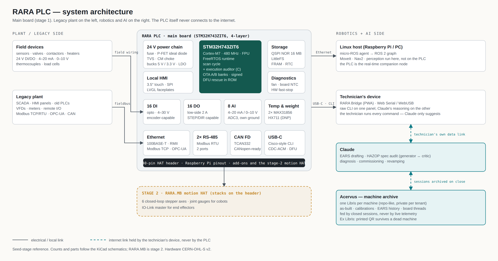
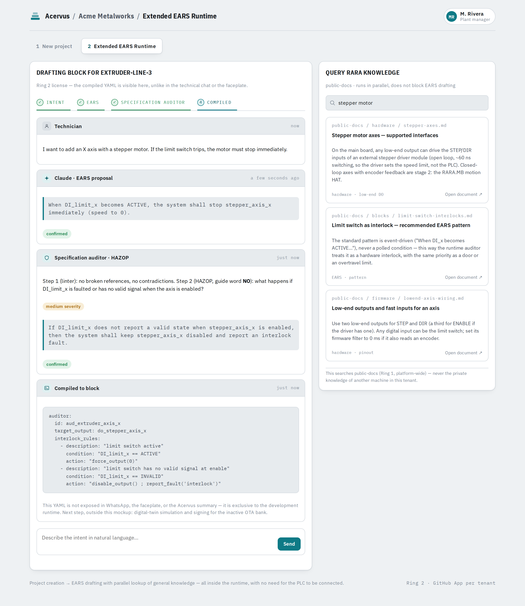
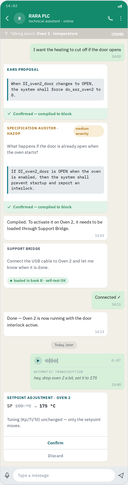
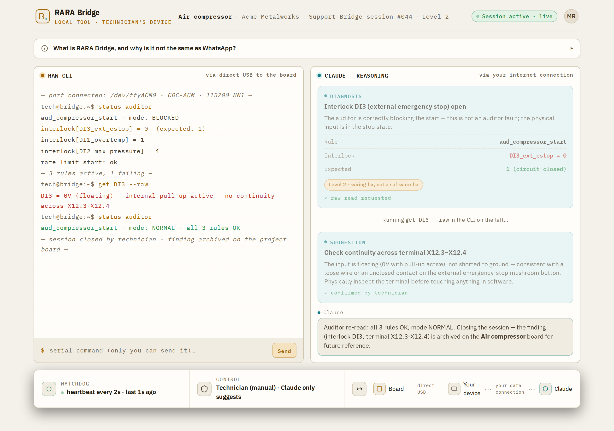
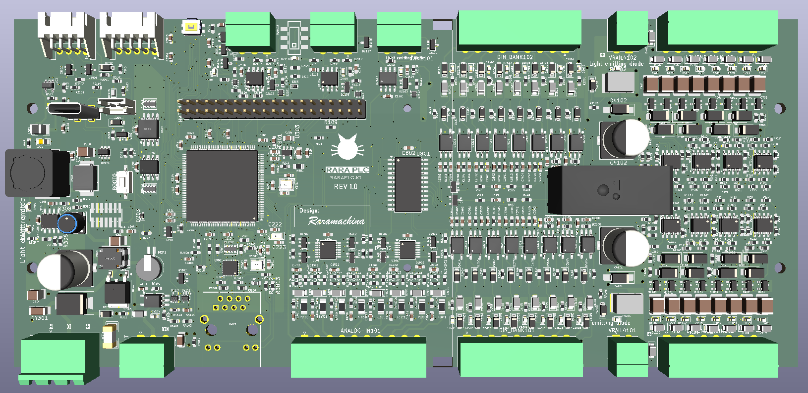

# RaraPLC

**Open hardware industrial PLC on the STM32H743, that speaks the legacy plant (Modbus, OPC-UA, CAN) and robotics (ROS 2) on the same board, and lets a technician change machine logic by describing it, with AI checking the requirement before any code exists.**

<picture>
  <source media="(prefers-color-scheme: dark)" srcset="docs/assets/diagrams/system-architecture-dark.png">
  
</picture>

**New here?** [`docs/POSITIONING.md`](docs/POSITIONING.md) is the five-minute version. [`docs/ARCHITECTURE.md`](docs/ARCHITECTURE.md) explains the diagram above.

## What is RaraPLC

An industrial PLC whose hardware and firmware are open, built around the STM32H743 (Arm Cortex-M7, 480 MHz). It is designed around three goals at the same time:

**1) AI in the firmware/software stack.** Claude is a working part of the development pipeline: schematic and PCB review, firmware architecture, code review, documentation. Add-ons are self-describing so an LLM can write their drivers directly, without an OS driver model: [`docs/SELF_DESCRIBING_ADDONS.md`](docs/SELF_DESCRIBING_ADDONS.md).

**2) AI in commissioning and revamping.** Bringing RaraPLC into a new machine, or migrating a machine that runs an old closed PLC, with Claude assisting the technician end to end.

**3) AI as the memory of installed machines.** Every deployment becomes a documented, queryable archive (I/O maps, wiring, logic, history) that Claude can reason over years later.

## How a technician changes logic

The technician writes or says what they want. Claude drafts it as EARS requirements, a separate critic agent audits them with HAZOP guide words, the technician confirms, and the result is compiled into data for a fixed C runtime. **The model never writes C that runs in the control loop.** Full pipeline: [`docs/AI_WORKFLOW.md`](docs/AI_WORKFLOW.md).

<table>
<tr>
<td width="62%"><picture><source media="(prefers-color-scheme: dark)" srcset="docs/assets/mockups/ears-runtime-dark.png"></picture></td>
<td width="38%"><picture><source media="(prefers-color-scheme: dark)" srcset="docs/assets/mockups/technician-chat-dark.png"></picture></td>
</tr>
<tr>
<td><sub><b>Extended EARS Runtime</b>: intent → EARS → HAZOP finding → compiled block.</sub></td>
<td><sub><b>Technician's chat</b>: the same pipeline from a phone. No YAML, ever.</sub></td>
</tr>
</table>

## Remote hands, not remote access

The PLC never connects to the internet. For live diagnosis, **RARA Bridge** runs on the technician's own laptop or phone, connected to the board by USB; Claude reads what the technician shares and suggests the next step, but every command is run by the technician. Details: [`docs/SUPPORT_BRIDGE.md`](docs/SUPPORT_BRIDGE.md).

<picture>
  <source media="(prefers-color-scheme: dark)" srcset="docs/assets/mockups/bridge-dark.png">
  
</picture>

Everything learned about a machine ends up in **Acervus**, a static, repo-like archive with one project (*Libris*) per machine, fed by closed sessions, never by live telemetry: [`docs/ACERVUS.md`](docs/ACERVUS.md).

The UI images are concept mockups with fictional data; the clickable versions are in [`docs/demos/`](docs/demos/).

## Hardware at a glance

| | Main board |
|---|---|
| Compute | STM32H743ZIT6, FreeRTOS, A/B OTA, ROM DFU recovery |
| I/O | 16 DI opto-isolated, encoder-capable · 16 DO 2 A low-side, STEP/DIR-capable · 8 AI 4–20 mA / 0–10 V |
| Comms | Ethernet (Modbus TCP, OPC-UA, micro-ROS) · 2× RS-485 · CAN FD · USB-C |
| Expansion | 40-pin HAT header, Raspberry Pi pinout |

**Stage 2, RARA.MB:** a motion HAT for six closed-loop stepper axes, joint gauges for cobots, and IO-Link to control end effectors. The focus today is getting the PLC running first.

More: [`docs/ARCHITECTURE.md`](docs/ARCHITECTURE.md) · [`docs/WHY_STM32H7.md`](docs/WHY_STM32H7.md).

## Open hardware, open source

Hardware is released under CERN-OHL-S v2 (see `hardware/LICENSE`). Firmware is released under the Mozilla Public License 2.0 (see `firmware/LICENSE`): improvements to the runtime's own files must be shared back, while your own application code and add-on modules on top can stay private. Components are chosen to be sourceable (LCSC part numbers alongside every design) and, where possible, in small standard packages so small shops and hobbyists can build it too.

## Main board, Rev 1.0



STM32H743 main board, 3D render from KiCad. 16 DI, 16 DO, 8 AI, Ethernet, 2× RS-485, CAN FD, USB-C and a 40-pin HAT header.

## Project status

Seed stage. The runtime has been running the founder's own food-production machines for about 2,000 hours. The main board schematics are being finalized in KiCad and will be published here, with BOM and 3D files, once they are fabrication-ready.

## Repository structure

```
firmware/   STM32H743 firmware (HAL/Cube + Arduino_Core_STM32 compatible)
hardware/   Schematics, PCB, BOM, 3D files (CERN-OHL-S v2)
docs/       Architecture, AI workflow, design decisions, diagrams, UI demos
.github/    Issue/PR templates, community health files
```

## Roadmap

See [`docs/ROADMAP.md`](docs/ROADMAP.md). Near term: publish the v0.1 hardware (schematics + BOM with LCSC numbers), the firmware skeleton, and a first revamping case study documented end to end.

## Contributing

Contributions are welcome, see `CONTRIBUTING.md`. This project follows the Contributor Covenant (`CODE_OF_CONDUCT.md`).

## About

Built by [Rara Machina](https://github.com/jorgefelipechurio). RaraPLC is an independent, community-driven project and is not affiliated with or endorsed by STMicroelectronics or Anthropic.
