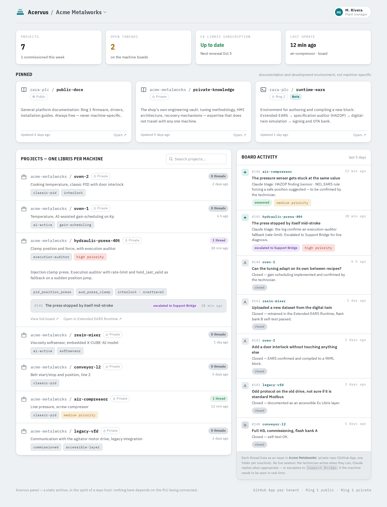
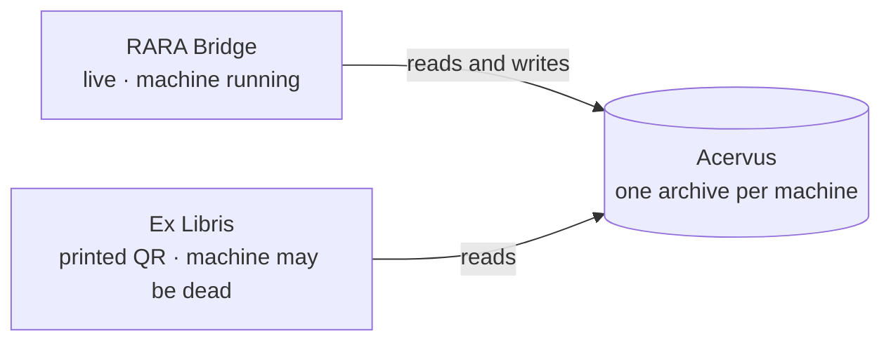

# Acervus: a machine archive, not a SCADA

*Acervus* (Latin for "heap, accumulation", the root of *acervo*, a body of knowledge) is where everything learned about a machine is kept: as-built wiring, calibrations, integration hacks, every EARS requirement and why it exists, and the history of every support session.

It follows the philosophy of a code-hosting site, not of a SCADA. It is a **static archive**. Nothing in it assumes the PLC is online. Every piece of evidence comes from a discrete event that has already finished: a closed RARA Bridge session, an Ex Libris scan, an OTA update. There is no continuous telemetry.

<picture>
  <source media="(prefers-color-scheme: dark)" srcset="assets/mockups/acervus-panel-dark.png">
  
</picture>

## Structure

| Element | What it is | Visibility |
|---|---|---|
| **Libris** | One repo-like project per machine: I/O map, as-built, EARS history, firmware images, board threads | Private to the plant (tenant) |
| **Public docs** | General RaraPLC documentation: firmware, drivers, patterns, installation | Public |
| **Private knowledge** | The workshop's own engineering know-how that does not belong to one machine: tuning method, HMI conventions, recovery procedures | Private to the tenant |
| **Extended EARS Runtime** | Where new blocks are drafted, audited and compiled | Private to the tenant |

Each Libris has a **board**, like issues on a code host. The technician writes problems, fixes or ideas; Claude triages them asynchronously and either answers on the thread or escalates to a live [RARA Bridge](SUPPORT_BRIDGE.md) session when the machine has to be seen running.

## One archive, two ways in

- **RARA Bridge** needs the machine alive and answering. It reads from and writes to the archive.
- **Ex Libris** is a QR code printed and stuck inside the cabinet. It works when nothing is alive, not even the PLC board, because the knowledge it points to is not on the machine. That is exactly when you need to know what to buy as a replacement.

They are kept as two access modes over a single archive, rather than one product, because designing everything for the "machine is dead" case would make live diagnosis needlessly hard. The knowledge itself is never duplicated.

*UI mockups are concept designs; names and data are fictional. Interactive version: [`demos/acervus.html`](demos/acervus.html).*
