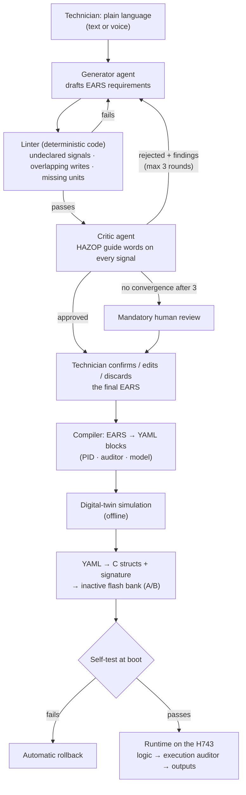
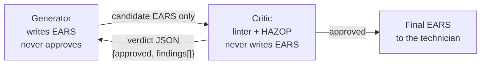

# AI workflow: from a sentence to verified control logic

RaraPLC lets a maintenance technician change machine logic by describing it in plain language, without learning ladder or C, and without letting a language model write code that runs in the control loop. This page describes how.

## The non-negotiable rule

**The model never writes C that runs in the control loop.** It writes requirements in a constrained natural language (EARS). Those requirements are audited, confirmed by a human, and compiled into *data* (YAML → C structs) that a fixed, already-tested C runtime interprets. Changing behaviour means changing data, never the runtime.

## Pipeline



## Why EARS

Free conversation is ambiguous ("set it to 180": setpoint or gain? °C or °F?). YAML is precise, but a technician will not write or read it. **EARS** (Easy Approach to Requirements Syntax, developed at Rolls-Royce for jet-engine control) sits in between: still readable English, restricted to five patterns that remove ambiguity and translate mechanically into blocks.

| Pattern | Template |
|---|---|
| Ubiquitous | The system shall ⟨response⟩. |
| Event-driven | When ⟨trigger⟩, the system shall ⟨response⟩. |
| State-driven | While ⟨state⟩, the system shall ⟨response⟩. |
| Unwanted behaviour | If ⟨condition⟩, then the system shall ⟨response⟩. |
| Optional feature | Where ⟨feature⟩, the system shall ⟨response⟩. |

Example, an oven door interlock:

```text
Technician:  "I want the heating to cut off if the door opens"
Generator:   When DI_oven2_door changes to OPEN, the system shall force do_ssr_oven2 to 0.
Critic:      HAZOP guide word NO / BEFORE — what if the door is already open at start-up?
             → If DI_oven2_door is OPEN when the oven is enabled, then the system shall
               prevent start-up and report an interlock.
Technician:  confirms both
```

## Generator and critic are two separate agents

Running generation and critique in one prompt degrades the audit: the model tends to defend what it just wrote. They are two API calls with different system prompts, and the critic never sees the original conversation or the generator's reasoning, only the candidate EARS.



The critic returns a structured verdict:

```json
{
  "approved": false,
  "findings": [{
    "severity": "high",
    "category": "sensor — NO (missing data)",
    "reason": "PV_temp_oven2 can go stale without any rule detecting it",
    "suggested_ears": "If PV_temp_oven2 is not updated for more than 5 s or is outside -50..500 °C, then the system shall force do_ssr_oven2 to 0 and report a sensor fault."
  }]
}
```

The loop stops at three rounds. If the two agents have not converged by then, nothing is auto-approved: the case goes to a human. It is the same philosophy as the runtime auditor's fallback: under uncertainty, stop and ask, do not keep trying alone. All rounds are stored next to the confirmed EARS so anyone can later see why each interlock was added or dropped.

## Two auditors, not one

| | Specification auditor | Execution auditor |
|---|---|---|
| When | Design time, on the host, before compiling | Every scan cycle, on the H743 |
| Looks at | The EARS text the technician confirmed | Every output value before it reaches an actuator |
| Method | Deterministic linter + HAZOP critic | Range, rate limit, interlocks |
| May use an LLM | Yes (HAZOP layer only) | No: deterministic C, no exceptions |

## What it looks like

The Extended EARS Runtime: intent → EARS proposal → HAZOP finding → compiled block, with a side panel that searches only the public documentation.

<picture>
  <source media="(prefers-color-scheme: dark)" srcset="assets/mockups/ears-runtime-dark.png">
  
</picture>

The same pipeline from a phone, in the technician's chat. YAML is never shown here, only EARS cards, HAZOP findings and setpoint adjustments:

<picture>
  <source media="(prefers-color-scheme: dark)" srcset="assets/mockups/technician-chat-dark.png">
  
</picture>

Interactive versions: [`demos/`](demos/).

## Where RaraPLC differs from vendor copilots

Siemens, Schneider and CODESYS already generate IEC 61131-3 code from prompts, inside their own IDEs, for automation engineers, and review the *generated code*. RaraPLC targets the maintenance technician, reviews the *requirement* before any code exists, applies HAZOP to the intent rather than linting the output, and needs no IDE: the interface is the conversation.

*UI mockups are concept designs; names and data are fictional.*
