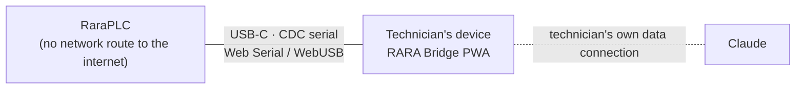

# RARA Bridge: remote hands, not remote access

RARA Bridge is how Claude helps diagnose a running machine **without the PLC ever being connected to the internet**. It is a small local app (PWA) that runs on the technician's own laptop or phone.

<picture>
  <source media="(prefers-color-scheme: dark)" srcset="assets/mockups/bridge-dark.png">
  
</picture>

## Two links that never touch

- The board talks to the technician's device over a **USB cable**. Nothing else.
- The device talks to Claude over **the technician's own data connection**, which never enters the plant network.
- **The technician runs every command.** Claude reads what the technician shares, explains it, and suggests the next step. It cannot send anything to the board.

This is the "remote hands" model: expertise travels, control does not.

## Design of the screen

- **Two panels, not one chat.** Left: the raw CLI (amber, monospace), exactly what the board says. Right: Claude's reasoning (teal), with confirmation cards. Protocol and interpretation are never mixed, the same separation the audit log keeps.
- **The status strip is the signature of the design:** watchdog heartbeat, *who has control right now* (always the technician), and the two links drawn as separate segments.
- **On a phone the hierarchy flips:** the action card Claude is asking you to confirm moves to the top, and the raw CLI collapses into a secondary panel below.

## Support levels

| Level | Who | Example |
|---|---|---|
| 1 | Claude, asynchronously, on the machine's board in Acervus | "The pressure sensor reads the same value all day" → HAZOP finding + suggested EARS |
| 2 | Claude + technician, live, through RARA Bridge | Start blocked by an interlock → raw read of DI3 → loose terminal found → re-audit OK |
| 3 | A human expert in the loop | Escalation from either of the above |

Each session ends with a summary archived on the machine's board in [Acervus](ACERVUS.md). Issues are created when the session closes, never in the middle of it.

## Hardware notes

- The H743's native USB OTG is used directly; no USB-serial bridge chip.
- Standard CDC-ACM class first (works with any serial terminal). A vendor-specific class that avoids OS driver conflicts on Android remains an option, to be decided on real hardware.
- No Bluetooth or Wi-Fi, by design: physical cable only.

*UI mockups are concept designs; names and data are fictional. Interactive version: [`demos/bridge.html`](demos/bridge.html).*
